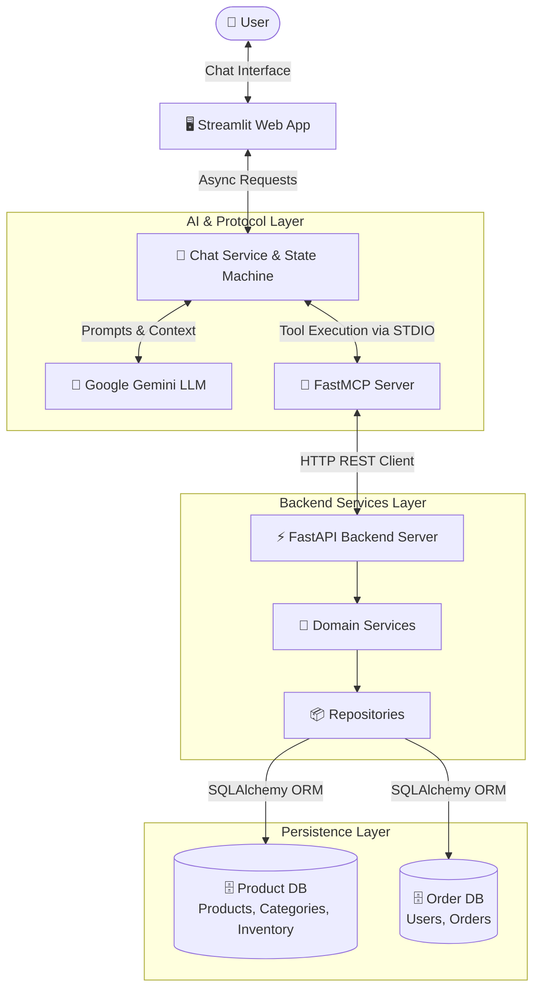
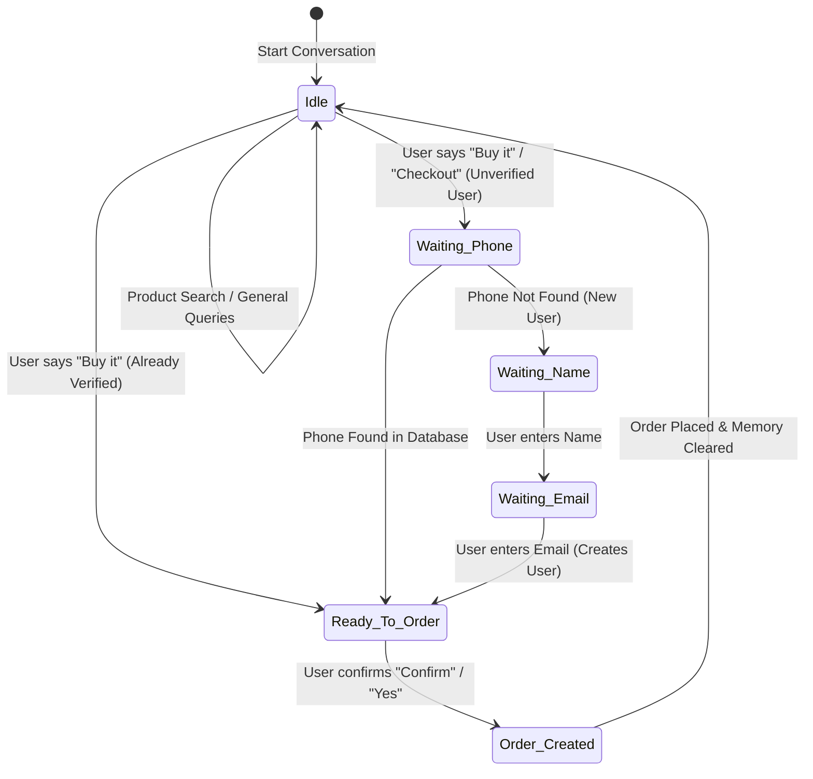
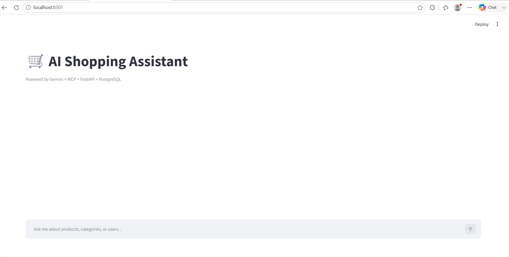
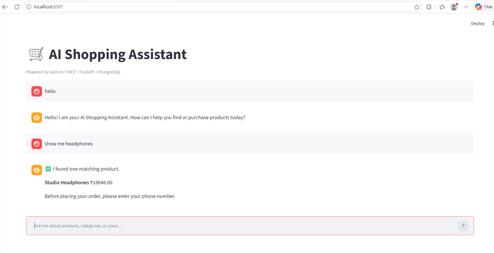
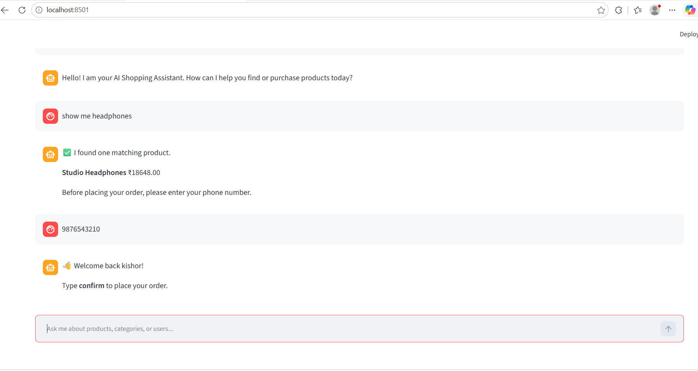
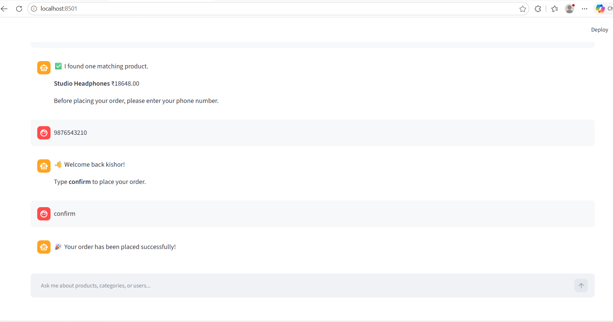

# 🛒 AI Shopping Assistant

<div align="center">

[](https://www.python.org/)
[](https://fastapi.tiangolo.com/)
[](https://aistudio.google.com/)
[](https://modelcontextprotocol.io/)
[](https://www.postgresql.org/)
[](https://streamlit.io/)
[](https://pytest.org/)
[](LICENSE)

**An intelligent, multi-turn conversational e-commerce assistant built with Google Gemini, Model Context Protocol (MCP), FastAPI, PostgreSQL, and Streamlit.**

[Features](#-key-features) • [Architecture](#-system-architecture) • [Workflow](#-state-machine--workflow) • [MCP Tools](#-mcp-tools-reference) • [API Docs](#-api-endpoints) • [Quickstart](#-quickstart--installation) • [Testing](#-testing)

</div>

---

## 📖 Overview

The **AI Shopping Assistant** transforms conversational commerce by combining large language model intelligence with deterministic backend systems using the **Model Context Protocol (MCP)**. 

Users can search products using natural language, filter by budget, receive tailored product recommendations, perform zero-friction user lookup or onboarding via phone verification, and securely place orders through structured database transactions.

---

## 🚀 Key Features

- 🤖 **Conversational Shopping Intelligence**: Powered by Google Gemini with prompt engineering and context memory.
- 🔗 **Model Context Protocol (MCP)**: Decoupled tool architecture enabling the LLM to interact with live backend databases.
- 🗄️ **Multi-Database Architecture**: Dedicated logical isolation between product catalog data (`product_db`) and transactional user/order records (`order_db`).
- 🧠 **Context & State Management**: Multi-step conversation memory tracking selected products, pending orders, and user identity across conversation turns.
- 👤 **Automated User Onboarding**: Seamless customer identification via phone number lookup and automatic registration for new users.
- 🔍 **Multi-Strategy Product Search**: Exact matching, phrase search, keyword tokenization with plural normalization, and strict price filtering (`min_price` / `max_price`).
- ⚡ **High-Performance REST Backend**: Clean layered architecture (Routes $\rightarrow$ Services $\rightarrow$ Repositories $\rightarrow$ SQLAlchemy ORM) powered by FastAPI.
- 🖥️ **Interactive Streamlit Web UI**: Real-time chat interface with chat history, instant responses, and status indicators.
- 🧪 **Full Automated Test Suite**: Built with Pytest covering schemas, memory state transitions, search algorithms, and API endpoints.

---

## 🏗️ System Architecture



### Data Flow Diagram

```
User Query
    │
    ▼
Streamlit Frontend ──► Chat Service ──► Conversation Memory
                             │                 ▲
                             ▼                 │
                    Gemini Decision ───────────┘
                             │
                      (Tool Selected)
                             │
                             ▼
                     FastMCP Server
                             │
                      (HTTP Request)
                             │
                             ▼
                      FastAPI Backend
                        ├── Product DB (Products, Categories, Inventory)
                        └── Order DB (Users, Orders)
                             │
                             ▼
                    Summarized Response
                             │
                             ▼
                     Streamlit User UI
```

---

## 🔄 State Machine & Workflow

The assistant implements a state machine to guide customers naturally from search to purchase:



### Example Conversation Flow

```text
User: "Show me studio headphones under 200"
Assistant: "I found:
            • Studio Headphones — ₹150.00 (SKU: AUDIO-001)"

User: "Buy it"
Assistant: "You selected Studio Headphones.
            Before placing your order, please enter your phone number."

User: "9876543210"
Assistant: "👋 Welcome back Alice! Type 'confirm' to place your order."

User: "Confirm"
Assistant: "🎉 Your order has been placed successfully!"
```

---

## 📸 Screenshots

| 🏠 Home Interface | 🔍 Product Selection |
| :---: | :---: |
|  |  |

| 👤 User Verification | ✅ Order Confirmation |
| :---: | :---: |
|  |  |

---

## 🛠️ Tech Stack

| Layer | Technologies | Description |
| :--- | :--- | :--- |
| **Frontend** | Streamlit | Responsive conversational chat interface |
| **AI / LLM** | Google Gemini 2.5 Flash / Flash-Lite | Intent classification, parameter extraction & response summarization |
| **Protocol** | Model Context Protocol (MCP) | FastMCP standard tool runtime & client orchestration |
| **Backend** | FastAPI, Uvicorn | Async REST API framework |
| **Database & ORM** | PostgreSQL, SQLAlchemy 2.0 | Multi-database relational storage and ORM modeling |
| **Validation** | Pydantic v2 | Robust schema definition and input validation |
| **Testing** | Pytest, Pytest-Asyncio, SQLite | Unit, integration, and repository testing |

---

## 📂 Project Structure

```
ai-shopping-assistant/
│
├── ai_assistant/                   # AI & Conversational Layer
│   ├── __init__.py
│   ├── app.py                     # Streamlit web application
│   ├── chat_service.py            # Main conversation orchestration & state machine
│   ├── config.py                  # Environment & Gemini configuration
│   ├── conversation_memory.py     # Stateful session memory tracker
│   ├── gemini_client.py           # Google Gemini API client & prompts
│   ├── mcp_client.py              # Model Context Protocol stdio client
│   └── tool_manager.py            # MCP-to-Gemini tool definition converter
│
├── app/                            # FastAPI REST Backend
│   ├── config/                    # Backend database settings
│   │   ├── __init__.py
│   │   └── config.py
│   ├── database/                  # Multi-database engines & session dependencies
│   │   ├── __init__.py
│   │   ├── dependencies.py        # Database session injectors
│   │   ├── order_db.py            # Order/User database engine & Base
│   │   └── product_db.py          # Product/Category/Inventory database engine & Base
│   ├── models/                    # SQLAlchemy ORM models
│   │   ├── __init__.py
│   │   ├── category.py            # Category table model
│   │   ├── inventory.py           # Inventory table model
│   │   ├── order.py               # Order table model
│   │   ├── product.py             # Product table model
│   │   └── user.py                # User table model
│   ├── repositories/              # Database access layer
│   │   ├── category_repository.py
│   │   ├── inventory_repository.py
│   │   ├── order_repository.py
│   │   ├── product_repository.py  # Multi-strategy search repository
│   │   └── user_repository.py
│   ├── routes/                    # API Route endpoints
│   │   ├── category_routes.py     # /categories
│   │   ├── inventory_routes.py    # /inventory
│   │   ├── order_routes.py        # /orders
│   │   ├── product_routes.py      # /products
│   │   └── user_routes.py         # /users
│   ├── schemas/                   # Pydantic v2 validation models
│   │   ├── category.py
│   │   ├── inventory.py
│   │   ├── order.py
│   │   ├── product.py
│   │   └── user.py
│   ├── services/                  # Business logic services
│   │   ├── category_service.py
│   │   ├── inventory_service.py
│   │   ├── order_service.py
│   │   ├── product_service.py
│   │   └── user_service.py
│   └── main.py                    # FastAPI application entrypoint
│
├── mcp_server/                     # Model Context Protocol Server
│   ├── database/                  # Session factories
│   │   ├── __init__.py
│   │   └── sessions.py
│   ├── tools/                     # Tool definitions exposed to LLM
│   │   ├── __init__.py
│   │   ├── category.py            # Category MCP tools
│   │   ├── inventory.py           # Inventory MCP tools
│   │   ├── order.py               # Order MCP tools
│   │   ├── product.py             # Product search & retrieval tools
│   │   └── user.py                # User lookup & registration tools
│   ├── utils/                     # Serializers
│   │   └── serializer.py
│   ├── api_client.py              # HTTP client connecting MCP to FastAPI
│   ├── server.py                  # FastMCP server runner
│   └── settings.py                # MCP configuration
│
├── tests/                          # Automated Pytest Suite
│   ├── __init__.py
│   ├── test_api_endpoints.py      # FastAPI endpoint integration tests
│   ├── test_json_parser.py        # Resilient JSON response parser tests
│   ├── test_memory.py             # Conversation state machine tests
│   ├── test_product_repository.py # Product search & price filter unit tests
│   └── test_schemas.py            # Pydantic v2 schema validation tests
│
├── images/                         # UI Screenshots & Assets
├── .env.example                    # Environment variable template
├── requirements.txt                # Pinned production dependencies
└── README.md                       # Project documentation
```

---

## 📦 MCP Tools Reference

The FastMCP server exposes standardized tools callable by the Gemini agent:

| Domain | Tool Name | Parameters | Description |
| :--- | :--- | :--- | :--- |
| **Products** | `search_products` | `keyword` (str), `min_price` (float), `max_price` (float) | Search products with keyword and price range |
| **Products** | `get_product` | `product_id` (int) | Retrieve product details by ID |
| **Products** | `list_products` | — | List all products in the catalog |
| **Categories** | `list_categories` | — | Retrieve all product categories |
| **Categories** | `get_category` | `category_id` (int) | Retrieve category by ID |
| **Inventory** | `list_inventory` | — | Retrieve stock levels across warehouses |
| **Inventory** | `get_inventory` | `inventory_id` (int) | Retrieve specific inventory record |
| **Users** | `get_user_by_phone` | `phone` (str) | Look up customer by phone number |
| **Users** | `create_user` | `name` (str), `email` (str), `phone` (str) | Register a new customer |
| **Users** | `get_user` | `user_id` (int) | Get user details by ID |
| **Users** | `list_users` | — | List all registered customers |
| **Orders** | `create_order` | `user_id` (int), `product_id` (int), `quantity` (int) | Create an order record |
| **Orders** | `get_order` | `order_id` (int) | Retrieve order details by ID |
| **Orders** | `list_orders` | — | List all orders |

---

## ⚡ REST API Endpoints

The FastAPI server provides comprehensive REST endpoints with automatic OpenAPI documentation available at `http://127.0.0.1:8000/docs`:

### Products & Categories
- `GET /products/` — List all products
- `POST /products/` — Create a new product
- `GET /products/{product_id}` — Get product by ID
- `GET /products/search?keyword={kw}&min_price={min}&max_price={max}` — Search products
- `PUT /products/{product_id}` — Update product
- `DELETE /products/{product_id}` — Delete product
- `GET /categories/` — List all categories
- `POST /categories/` — Create a new category

### Users & Orders
- `GET /users/` — List all users
- `POST /users/` — Create a new user
- `GET /users/{user_id}` — Get user by ID
- `GET /users/phone/{phone}` — Get user by phone number
- `GET /orders/` — List all orders
- `POST /orders/` — Create order (validates user & product existence)
- `GET /orders/{order_id}` — Get order details
- `GET /orders/user/{user_id}` — Get orders by user ID

### Inventory
- `GET /inventory/` — List inventory records
- `POST /inventory/` — Create inventory record
- `GET /inventory/{inventory_id}` — Get inventory details

---

## ⚙️ Quickstart & Installation

### 1. Prerequisites

- **Python 3.10+** installed
- **PostgreSQL** installed and running
- **Google Gemini API Key** (from [Google AI Studio](https://aistudio.google.com/))

---

### 2. Clone the Repository

```bash
git clone https://github.com/kishor-prog/ai-shopping-assistant.git
cd ai-shopping-assistant
```

---

### 3. Create & Activate Virtual Environment

```bash
# Windows
python -m venv venv
venv\Scripts\activate

# macOS / Linux
python3 -m venv venv
source venv/bin/activate
```

---

### 4. Install Dependencies

```bash
pip install -r requirements.txt
```

---

### 5. Configure Environment Variables

Copy `.env.example` to `.env`:

```bash
cp .env.example .env
```

Configure your `.env` with your PostgreSQL credentials and Gemini API Key:

```env
# Database Configuration
DB_HOST=localhost
DB_PORT=5432
DB_USER=postgres
DB_PASSWORD=your_postgres_password

PRODUCT_DB=product_db
ORDER_DB=order_db

# Google Gemini API Key
GEMINI_API_KEY=your_gemini_api_key_here
GEMINI_MODEL=gemini-2.5-flash

# Backend Configuration
BACKEND_URL=http://127.0.0.1:8000
MCP_REQUEST_TIMEOUT=10.0
```

---

### 6. Create PostgreSQL Databases

Create the two logical databases in PostgreSQL:

```sql
CREATE DATABASE product_db;
CREATE DATABASE order_db;
```

*(Tables are created automatically when FastAPI starts up).*

---

### 7. Run the Application Services

Open three terminal windows (or run in background):

#### Terminal 1: Start FastAPI Backend
```bash
python app/main.py
# Or using uvicorn:
# uvicorn app.main:app --reload --port 8000
```

#### Terminal 2: Start FastMCP Server
```bash
python mcp_server/server.py
```

#### Terminal 3: Launch Streamlit Web UI
```bash
streamlit run ai_assistant/app.py
```

Visit `http://localhost:8501` in your browser to interact with the shopping assistant!

---

## 🧪 Testing

Run the automated test suite with Pytest:

```bash
pytest tests/ -v
```

### Manual Testing Scripts

You can also run standalone test utilities in the project root:

```bash
# Test MCP tool listing
python test_mcp.py

# Test Gemini API connectivity
python test_gemini.py

# Test CLI interactive chat session
python test_chat.py
```

---

## 🔮 Future Roadmap

- [ ] **Vector Search & Semantic Retrieval**: Embeddings-based product search using pgvector.
- [ ] **Shopping Cart Management**: Multi-item cart checkout and discount vouchers.
- [ ] **Payment Gateway**: Integration with Stripe / Razorpay for secure checkout.
- [ ] **Voice Interaction**: Speech-to-text input and natural audio response synthesis.
- [ ] **Product Recommendations**: Collaborative filtering and personalized suggestions.

---

## 👨‍💻 Author

**Kishor**
- **GitHub**: [@kishor-prog](https://github.com/kishor-prog)
- **Repository**: [ai-shopping-assistant](https://github.com/kishor-prog/ai-shopping-assistant)

---

## 📄 License

This project is licensed under the [MIT License](LICENSE).
